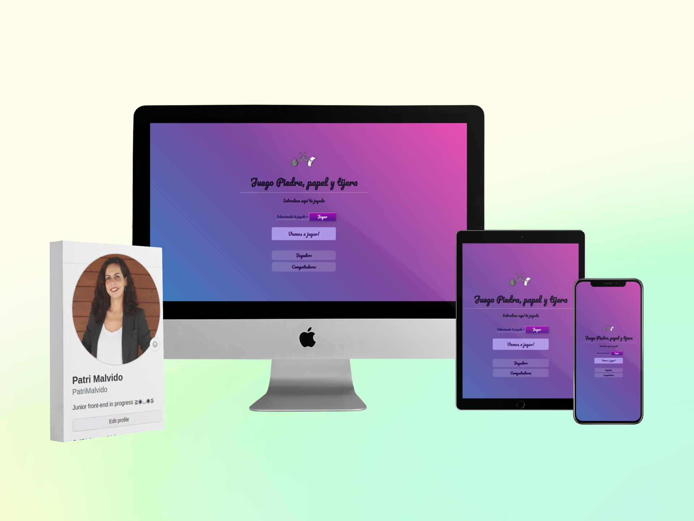

# Ejercicio de evaluación intermedia

El ejercicio consiste en desarrollar el juego "Piedra ,Papel y Tijera" usando JavaScript donde un jugador es el usuario y el otro la computadora. En el juego ambos jugadores tienen que hacer diferentes jugadas de piedra, papel o tijeras. Solo tiene dos resultados posibles: un empate o una victoria para un jugador y una derrota para el otro jugador. Para probarlo y jugar con él pincha [aquí](http://beta.adalab.es/modulo-2-evaluacion-intermedia-PatriMalvido/)

----------------------------------------
## Descripción :spiral_notepad:

El programa genera un movimiento al azar entre piedra, papel y tijera. Posteriormete la usuaria juega, el programa compara los movimientos y decide si la usuaria ha ganado, perdido o empatado contra el ordenador. También a su vez el programa va contabilizando el número de puntos del jugador y del odenador. El juego se reinicia cuando se hagan 10 movimientos.

----------------------------------------

## Pasos para la realización del juego :abc:

-Crear una función random para conseguir un número aleatorio del ordenador.
-Crear una funcion para un movimiento aleatorio con una especificaciones (para ello usar sentencias para comparar)
- Actualizar el contador de puntos en cada jugada.
- El juego se reinicia cuando se hagan 10 movimientos.
BONUS: al llegar a 10 movimientos aparece un botón de reiniciar y desaparece el de jugar, los contadores vuelven a 0 y si se pulsa vuelve a empezar todo el juego.

---------------------------------------------

## Maquetación :art:

El juego tiene diseño responsive para móvil, tablet y desktop. El botón tiene transiciones para un mejor efecto visual y he añadido un fondo con degradado.

--------------------------------------------

## Construido con: :gear: :hammer_and_wrench:

- HTML
- CSS 
- JavaScript

----------------------------------

## Autora: :woman_technologist:

- **Patri Malvido** [Github](https://github.com/PatriMalvido)

-----------------------------------

## Licencia  📄 

Este proyecto está bajo la Licencia MIT License mira el archivo [LICENSE](LICENSE) para más detalles